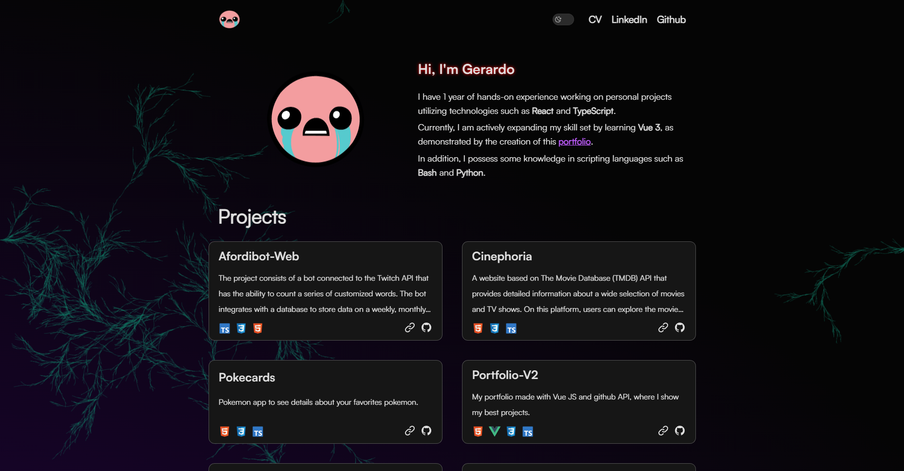

<div align="center">

<a href="https://portfolio-gerardo.vercel.app/" target="_blank">

</a>

</p>

<div align="center">
    <a href="https://portfolio-gerardo.vercel.app/" target="_blank">
        Website
    </a>
    <span>&nbsp;⁘&nbsp;</span>
    <a href="#-getting-started">
        Getting Started
    </a>
    <span>&nbsp;⁘&nbsp;</span>
    <a href="#-license">
        License
    </a>
</div>

</p>

</div>

## 🚀 Getting Started

We recommend using the following extensions for Visual Studio Code:

- [**Vue (Volar) for VSCode**](https://marketplace.visualstudio.com/items?itemName=Vue.volar).
- [**TypeScript Vue Plugin (Volar)**](https://marketplace.visualstudio.com/items?itemName=Vue.vscode-typescript-vue-plugin).

1. Clone the repository:

```bash
git clone https://github.com/Ch1py7/Portfolio-v2
```

2. Install dependencies:

```bash
npm install
# or
yarn install
# or
pnpm install
# or
ultra install
```

3. Run the development server:

```bash
npm run dev
# or
yarn dev
# or
pnpm dev
# or
ultra dev
```

Open up [http://localhost:5173/](http://localhost:5173/) to view the website 🚀.

## 📝 License

- [MIT license](https://github.com/Ch1py7/Portfolio-v2/blob/main/LICENSE).
